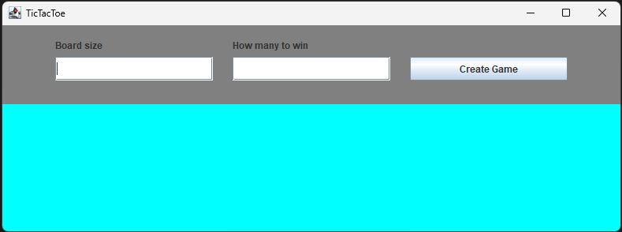
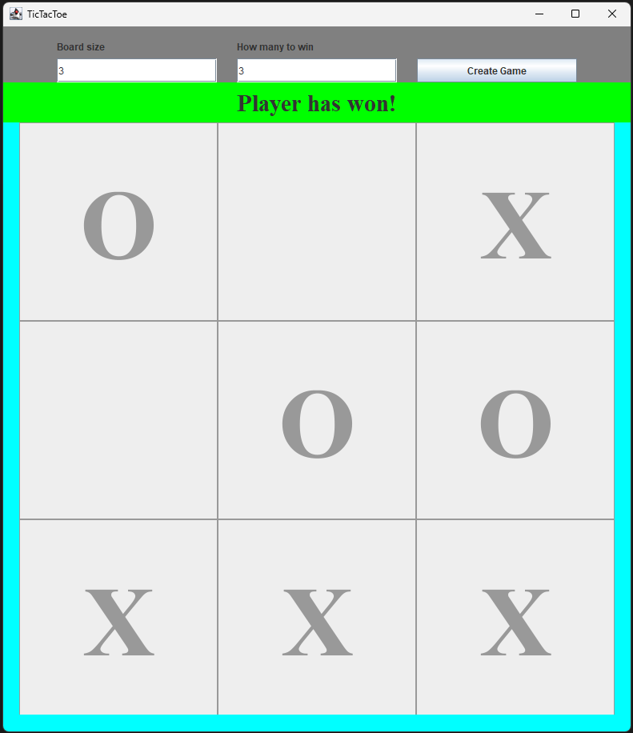
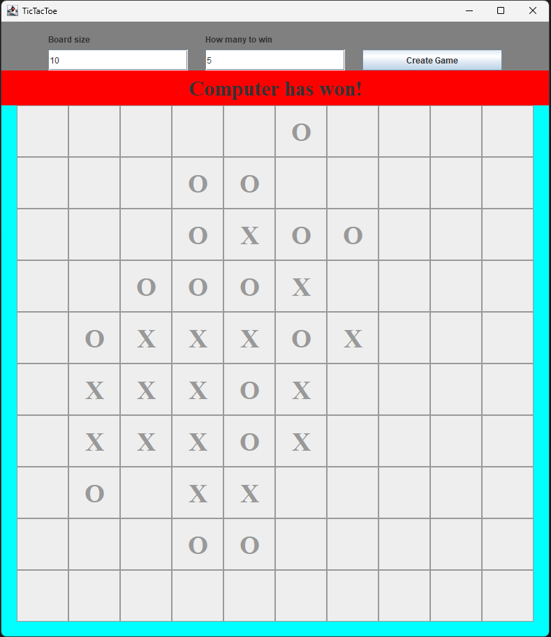
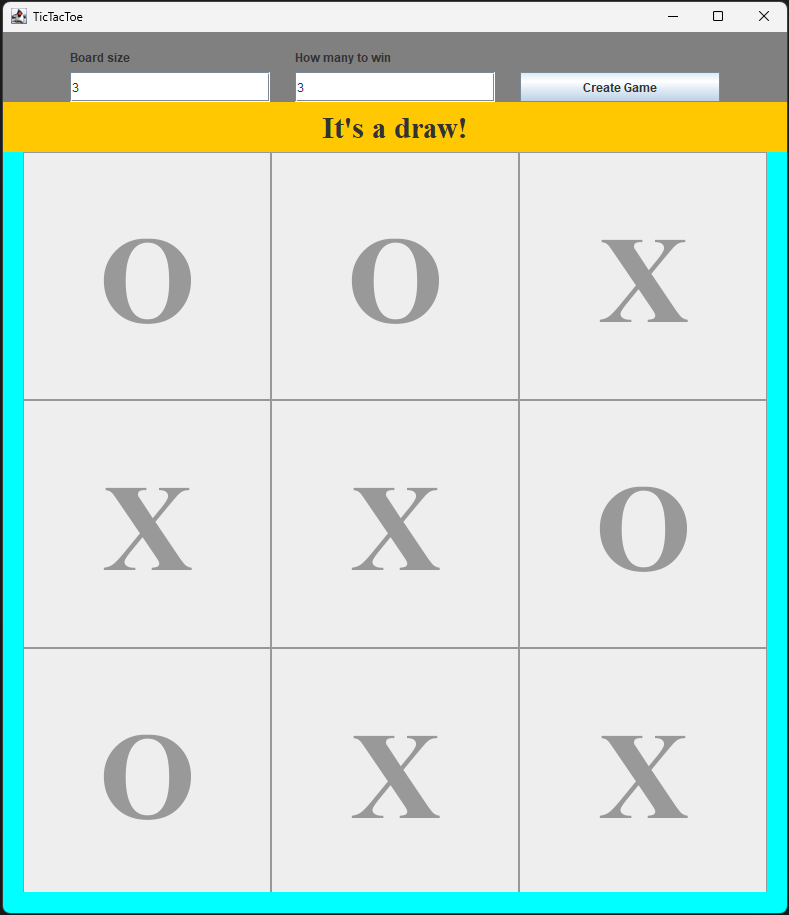
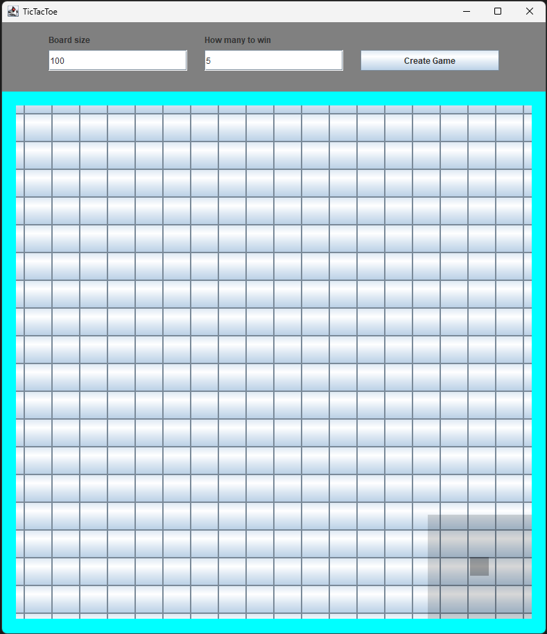

# TicTacToe

 

## About

This was the last exercise of a java beginner course.
 
 
How it works:
 

- Choose a board size of 3x3 through 200x200 and how many is needed for a win.
- If board size is too large for the game window, it creates a minimap which shows the current view and player can navigate the board with wasd keys.
- Player starts allways
- The computer opponent is a self made.
- Computer opponent is not optimized well to handle much bigger sizes than 10x10
- The best and most tested options are 3x3 board size with 3 to win and 10x10 board size with 5 to win.
- The game has three endings: player wins, computer wins or it is a draw.

 

## To compile and run

1. cd src/
2. javac main/\*.java
3. java main/TicTacToe

 

## Images

Image 1. Main screen.
 
 

Image 2. Player won.
 
 

Image 3. Computer won.
 
 

Image 4. It was a draw.
 
 

Image 5. Minimap shows on a large board size.
